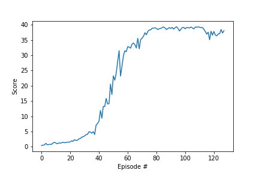

# Project: Continuous Control

## Learning Algorithm

To train the agent, we implemented the Deep Deterministic Policy Gradient algorithm with PyTorch. The goal of DDPG is to learn both an approximation of the optimal action-value function Q and the optimal policy using deep neural networks. The agent uses its experience to learn the Q function, and uses the Q function to learn the policy. DDPG is designed for environments with continuous action spaces, and can be seen as an extension of DQN which only works for environments with discrete action spaces.

In our implementation, a single agent collects the observations from the 20 different environments, and uses them to learn a single Q function and policy shared by all the agents. The actor and critic networks, which respectively learn the policy and the Q function, contain 2 hidden layers, with 400 neurons in the first layer, and 300 neurons in the second layer. In both networks, we use Batch Normalization to improve the performance of the network, and help it learn faster.

We used the following hyper-parameters:

- Replay buffer size = 1e6
- Batch size = 256
- Discount factor = 0.99
- Learning rate for target parameters = 1e-3
- Learning rate for network optimizer = 1e-3

## Plot of Rewards

After 128 episodes, the agents managed to get an average reward greater than 30 over 100 consecutive episodes, and successfully solved the environment.

## Ideas for Future Work

To improve the agent's performance, we could use Prioritized Experience Replay, which enables some experiences to be sampled in priority from the replay buffer, depending on how much information we can learn from them.
